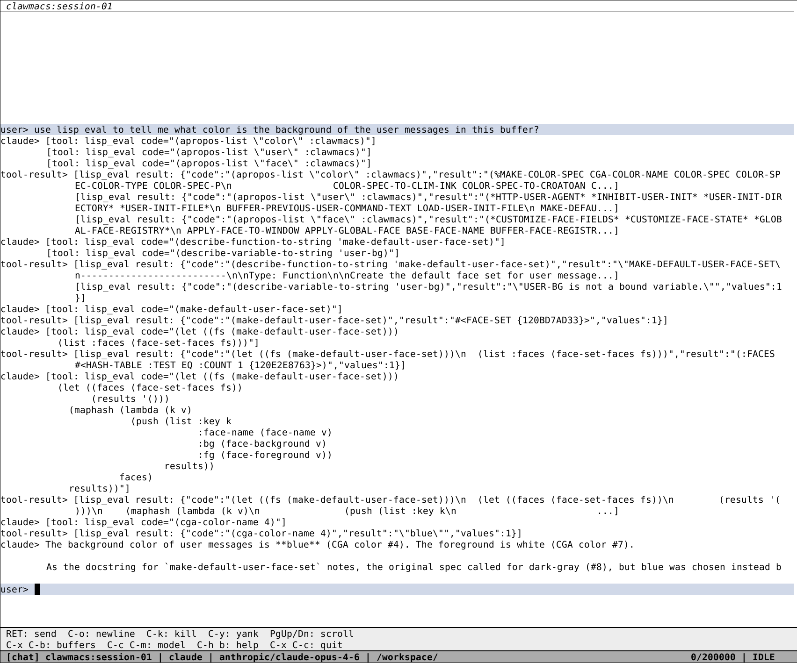

#+TITLE: Clawmacs
#+STARTUP: overview

*WARNING: This project is pre-dogfood and under active development.*

Macros for your agent!

* Introduction

Anyone who has used Emacs before knows the benefit of a tight feedback loop. Write lisp code, eval it, instant results. Clawmacs brings that same philosophy to agentic programming: the tighter the feedback loop between you and the agent, and the more the agent can introspect its own environment, the more powerful the collaboration becomes.

Clawmacs is a Lisp-native, Emacs-inspired LLM chat interface written entirely in Common Lisp. It gives you and your AI agent a shared, programmable environment with full access to the running Lisp image. The agent can read, write, and edit sandboxed files directly through Lisp data mode, and it can use =lisp_eval= to inspect the editor, search symbols, read docs, call functions, and update runtime state inside the live Common Lisp process.

#+ATTR_ORG: :width 800

* Features

** Multi-Provider LLM Support

Clawmacs supports multiple LLM providers, switchable per buffer:

- *Z.AI* (Zhipu AI) --- GLM models
- *OpenAI Codex* --- with shared Codex OAuth/API-key auth and the Responses API
- *OpenRouter* --- access to hundreds of models with dynamic model discovery

Switch agents on the fly with =C-c A=. Switch models on the fly with =C-c C-m= (fuzzy minibuffer selector) or =C-c M= (overlay selector). Run interactive commands with =M-x=, including minibuffer prompting for command arguments.

** OpenAI Codex Auth

OpenAI Codex auth follows Codex's own credential layout:

- =~/.config/clawmacs/openai-codex-token= is the highest-precedence raw bearer override.
- Otherwise clawmacs reads and refreshes shared Codex credentials from =~/.codex/auth.json=.
- The browser login flow uses a localhost callback at =http://localhost:1455/auth/callback= and falls back to another local port if 1455 is busy.
- ChatGPT-backed Codex auth uses =https://chatgpt.com/backend-api/codex=, while API-key auth uses =https://api.openai.com/v1=.

** Agent Tools

The default built-in agent tool surface follows Pi-style coding tools, with
provider tools as the primary action surface:

| Tool         | Permission             | Description                          |
|--------------+------------------------+--------------------------------------|
| =read=       | agent-allowed          | Read text files in the sandbox       |
| =find=       | agent-allowed          | Search files by name or wildcard     |
| =grep=       | agent-allowed          | Search file contents by literal text |
| =write=      | agent-allowed          | Create or overwrite sandboxed files  |
| =edit=       | agent-allowed          | Replace exact text in sandboxed files |
| =lisp_eval=  | agent-allowed          | Evaluate Common Lisp in the running image |

By default, agents use exposed provider tools for workspace search and text
changes. Tool inputs and tool results are represented as Lisp data, for example
=(edit :path "src/foo.lisp" :old-text "old" :new-text "new")=.
The =write= and =edit= tools reject content that leaves Lisp parentheses
unbalanced.
Custom tools may be registered explicitly with =register-tool= or tagged through
=deftool=. Imported packages contribute tools as soon as their =deftool= forms
are evaluated.

The =lisp_eval= tool is the fallback for Common Lisp tests, introspection, live
system updates, and defining helper tools when no exposed tool fits. Standard
Common Lisp reference lookup is available through a vendored offline snapshot of
=cl-community-spec=, and imported library discovery is handled locally through
ASDF metadata, package exports, docstrings, and source/doc search helpers.

=lisp_eval= captures printed output, error output, and multiple return values.
Its tool result is a printed Lisp plist. Recent calls are available with
=(eval-history-to-string)=, and the latest success/error are exposed through
=*last-eval-result*= and
=*last-eval-condition*=.

** Skills

Clawmacs supports Codex-style local skills: a skill is a directory containing a
=SKILL.md= file with YAML frontmatter and task-specific instructions. Enabled
skills are listed in the agent system prompt, can be selected from the UI, and
can be invoked in chat with =$skill-name=. When a user message mentions a skill,
Clawmacs injects a Codex-compatible contextual block for that turn:

#+begin_example
<skill>
<name>demo</name>
<path>/path/to/demo/SKILL.md</path>
...
</skill>
#+end_example

Skill discovery scans repo-local =.agents/skills/= directories, then
=~/.clawmacs.d/skills/=, =~/.agents/skills/=, =~/.clawmacs.d/skills/.system/=,
and roots registered from Lisp. Use =C-c s= to insert an exact linked skill
mention and =C-c S= to toggle skills.

#+begin_src lisp
(list-skills)
(describe-skill-to-string "common-lisp")
(read-skill-instructions "common-lisp")
(skill-list-files "common-lisp")
(skill-read-file "common-lisp" "references/notes.md")
(skill-search-to-string "common-lisp" "hash table")
#+end_src

Skills do not add new agent tools or widen permissions. Agents inspect skill
instructions and resources through =lisp_eval=, and scripts/assets are local
resources unless other Clawmacs APIs explicitly execute or use them.

** Project Resources

Persistent edits are exposed through a Lisp project/resource layer rather than
through direct agent file tools. Project definitions can be registered from
=~/.clawmacs.d/init.lisp= with =define-project=, and inert manifest files are
autoloaded from =*project-definitions-directory*=, which defaults to
=~/.clawmacs.projects.d/=. The user configuration directory is always available
as the =config= project unless init defines =config= first.

#+begin_src lisp
(define-project "clawmacs" :root #P"/home/tay/projects/clawmacs/")
(create-project "scratch-work" :root #P"/tmp/scratch-work/" :persist nil)
(list-projects)
(project-list-files "clawmacs")
(project-search-to-string "clawmacs" "send-message")
(project-read-file "clawmacs" "src/main.lisp")
(project-save-file "clawmacs" "notes.org" "* Notes\n")
(project-open-file "clawmacs" "src/main.lisp")
#+end_src

Open project resources become editable file buffers. =C-x C-f= opens a project
file, =C-x p= selects the current buffer's project, and =C-x C-s= saves a file
buffer back to its project resource. Programmatic project writes synchronize any
already-open file buffer for the same resource; agents can inspect unsaved
buffer state with =(file-buffer-dirty-p BUFFER)=.

For durable coding work, agents should prefer transactional change sets. A
change set stages project edits, exposes a Lisp-readable diff, and can be
applied, discarded, or reverted:

#+begin_src lisp
(let ((cs (begin-change-set :name "demo-edit")))
  (stage-project-file "clawmacs" "notes/demo.lisp" "(defun demo () :ok)"
                      :change-set cs)
  (change-set-diff-to-string cs)
  (apply-change-set cs))
#+end_src

Projects can also expose validation and reload hooks through =define-project=:

#+begin_src lisp
(define-project "clawmacs"
  :root #P"/home/tay/projects/clawmacs/"
  :systems '("clawmacs" "clawmacs/tests")
  :check-functions
  (list (lambda (project)
          (declare (ignore project))
          ;; Project-specific checks can call FiveAM, ASDF, or other Lisp APIs.
          :ok)))

(run-project-checks "clawmacs")
(reload-project-system "clawmacs")
#+end_src

** Agent Structural Editing

Clawmacs includes =sexed=, an agent-oriented s-expression editor inspired by
Paredit but exposed as Lisp functions instead of cursor commands. It lets agents
inspect, select, and edit Lisp forms by structure while rejecting edits that
would leave unbalanced text.

#+begin_src lisp
(sexed-project-outline-to-string "clawmacs" "src/main.lisp" :head "defun" :limit 20)
(sexed-project-form-text "clawmacs" "src/main.lisp"
                         '(:head "defun" :name "ensure-scratch-buffer"))
(sexed-replace-project-form
 "clawmacs"
 "src/foo.lisp"
 '(:head "defun" :name "foo")
 "(defun foo () :ok)")

(sexed-stage-replace-project-form
 "clawmacs"
 "src/foo.lisp"
 '(:head "defun" :name "foo")
 "(defun foo () :better)")
(change-set-diff-to-string)
(apply-change-set)

(ensure-scratch-buffer)
(setf (scratch-buffer-text) "(workspace (todo alpha) (todo beta))")
(sexed-replace-scratch-form '(:head "todo" :nth 1) "(done beta)")
(sexed-insert-after-scratch-form '(:head "done") "(note \"checked\")")
(scratch-buffer-text)
#+end_src

Selectors are plists such as =(:head "defun" :name "foo")=, =(:head "let*" :nth 0)=,
or =(:id 7)=. The =:nth= selector is zero-based. Pure functions such as
=sexed-replace-form= return edited strings; project, file, message, and scratch
adapters validate the full result before mutating resources or editable
clawmacs messages.
Insert helpers add separator whitespace when adjacent forms would otherwise
touch.

** Emacs-Style Interface

Three-pane layout: main (chat history + input), modeline (status), minibuffer (prompts and completion).

*** Editing Keybindings

| Key           | Action                     |
|---------------+----------------------------|
| =C-a= / =C-e=  | Beginning / end of line    |
| =C-f= / =C-b=  | Forward / backward char    |
| =M-f= / =M-b=  | Forward / backward word    |
| =C-d=           | Delete char forward        |
| =Backspace=     | Delete char backward       |
| =C-k=           | Kill line                  |
| =C-u=           | Kill backward line         |
| =M-d=           | Kill word forward          |
| =C-w=           | Kill word backward         |
| =C-y=           | Yank (paste)               |
| =M-y=           | Yank pop (cycle kill ring) |
| =C-o=           | Insert newline             |
| =RET=           | Send message               |

*** Buffer Management

| Key           | Action                       |
|---------------+------------------------------|
| =C-x n=        | New buffer                   |
| =C-x k=        | Kill buffer                  |
| =C-x b=        | Buffer selector (overlay)    |
| =C-x C-b=      | Buffer selector (minibuffer) |
| =C-x C-s=      | Save session                 |
| =C-x C-c=      | Quit                         |

*** Navigation

| Key              | Action              |
|------------------+----------------------|
| =Page-Up= / =M-v= | Scroll up (history)  |
| =Page-Down= / =C-v= | Scroll down        |

*** Model & Provider

| Key           | Action                             |
|---------------+------------------------------------|
| =C-c A=        | Select agent (fuzzy minibuffer)    |
| =C-c C-m=      | Select model (fuzzy minibuffer)    |
| =C-c M=        | Select model (overlay)             |
| =C-c t=        | Toggle tool result display         |
| =C-c C-d=      | Toggle API debug mode              |

*** Help & Introspection

| Key           | Action                       |
|---------------+------------------------------|
| =M-x=          | Execute command              |
| =C-h b=        | Describe keybindings         |
| =C-h f=        | Describe function            |
| =C-h v=        | Describe variable            |
| =C-h T=        | Describe type                |
| =C-h F=        | Customize face (interactive) |

** Shell Prefix

Type =!= followed by a shell command (e.g., =!ls -la=) to execute it directly. Output is inserted as a system message in the buffer without being sent to the agent. You can then discuss the output with the agent by sending a follow-up message.

** Streaming Responses

Agent responses stream in real time via background threads. The event loop polls for updates, so you see tokens as they arrive.

** Face System

Clawmacs has a full face (color/attribute) system inspired by Emacs:

- Per-sender color schemes (user messages on blue, agent on black, system in cyan)
- Global faces for modeline, minibuffer, selectors, approval prompts, diff highlighting
- Face inheritance chains with full resolution
- Interactive face customization via =C-h F=
- Supports CGA (16-color), 256-color, and hex (#RRGGBB) color specs

** Session Persistence

Save and restore conversation sessions with =C-x C-s=. Sessions are serialized to JSON.

** Scratch Buffer

Clawmacs keeps a process-local =*scratch*= buffer loaded in the buffer list for
temporary notes and programmatic coordination. It is editable, never killed by
normal buffer-kill commands, and lasts only until Clawmacs exits.

** Pluggable UI Backends

The rendering layer is abstracted behind a backend protocol:

- *Croatoan backend* (default) --- ncurses terminal UI
- *McCLIM backend* (optional) --- X11/Wayland graphical UI with monospace grid rendering

Switch backends in your init file. The McCLIM backend mirrors the terminal UI with the same three-pane layout, keybindings, and color scheme.

** Boot Files

Clawmacs loads optional markdown files at startup to customize the agent's system prompt:

- =AGENTS.md=, =SOUL.md=, =USER.md=, =IDENTITY.md=, =TOOLS.md=

Checked in the working directory first, then =~/.config/clawmacs/=. Compatible with OpenClaw workspace conventions.

* Installation

** Prerequisites

- [[https://guix.gnu.org/][GNU Guix]] (for the containerized environment)
- An X11 display (for the McCLIM backend)

** Running

#+begin_src sh
./run.sh
./run.sh --clean-build
#+end_src

This launches clawmacs in a Guix container with all dependencies (SBCL, ncurses, OpenSSL, fonts) automatically provisioned. Quicklisp is bootstrapped on first run.

By default, =run.sh= reuses cached ASDF/FASL build artifacts for fast startup.
Pass =--clean-build=, or its alias =--force-clean-build=, to clear the local
Common Lisp output cache before loading clawmacs.

For one-shot, non-interactive harness checks, use =prompt.sh=. It runs inside
the same Guix container and prints only the final assistant response to stdout
by default:

#+begin_src sh
./prompt.sh "Use lisp_eval to inspect the current default provider."
./prompt.sh --show-tools --show-metadata "List the exported clawmacs functions."
./prompt.sh --json --provider openai-codex --model gpt-5.3-codex "Summarize this repo."
./prompt.sh --clean-build "Run this prompt after clearing cached Lisp build artifacts."
./prompt.sh --isolated --show-tools "Exercise project APIs without user config state."
./prompt.sh --isolated --skill-root /tmp/my-skills 'Use $demo to answer.'
#+end_src

Plain =prompt.sh= runs default to =openai-codex/gpt-5.3-codex=. Passing
=--agent= lets that agent's routing decide unless =--provider= or =--model=
is also supplied.

By default, =prompt.sh= reuses cached ASDF/FASL build artifacts for fast
iterations. Pass =--clean-build=, or its alias =--force-clean-build=, to clear
the local Common Lisp output cache before loading clawmacs. If no prompt
argument is supplied, =prompt.sh= reads non-interactive stdin.

Live harness regression probes are available through:

#+begin_src sh
scripts/prompt-probes.sh
scripts/prompt-probes.sh --only transaction --keep-logs
#+end_src

The probes run through =prompt.sh --isolated=, write logs under =/tmp=, and
check real agent behavior for docs discovery, skill loading, transactional
project edits, and scratch/file-buffer workflows. By default they use
=openai-codex/gpt-5.3-codex= first, then retry with
=openrouter/openai/gpt-5.3-codex= if the primary provider fails.

** Provider Credentials

Set provider credentials through the supported provider-specific sources. Z.AI
and OpenRouter can use environment variables:

#+begin_src sh
export ZAI_CODING_MAX_API_KEY="..."
# or
export OPENROUTER_API_KEY="..."
#+end_src

OpenAI Codex uses the shared Codex auth store or a token file as described
above.

** User Init File

Customize clawmacs by creating =~/.clawmacs.d/init.lisp=:

#+begin_src lisp
;; Switch default provider and model
(setf clawmacs:*default-provider* :zai)
(setf clawmacs:*default-model* "glm-5")

;; Override the default personality prompt or point to a different prompt file
(setf clawmacs:*default-personality-prompt* "You are a pragmatic pair programmer.")
(setf clawmacs:*personality-prompt-path* #P"/home/tay/.config/clawmacs/pair-system-prompt.txt")
(clawmacs:load-personality-prompt-file)

;; Register custom agents for the C-c A selector
(clawmacs:register-agent-definition
 "writer"
 :provider :openai-codex
 :model "gpt-5.4"
 :think-level "high"
 :core-prompt "Use lisp_eval for concrete work. Inspect first, then modify."
 :personality-prompt "You are a concise writing partner focused on structure and tone.")

;; Register additional skill roots or programmatic skills
(clawmacs:register-skill-root #P"/home/tay/.local/share/clawmacs/skills/")
(clawmacs:register-skill-definition
 "repo-review"
 :description "Review Common Lisp changes in this repository."
 :contents
 (format nil "---~%name: repo-review~%description: Review Common Lisp changes.~%---~%Use project APIs, run tests, and report risks first."))

;; Customize seeded defaults after startup initialization
(clawmacs:add-hook
 'clawmacs:*startup-hook*
 (lambda ()
   (clawmacs:keymap-bind clawmacs:*default-keymap*
                         '(:ctrl-c #\z)
                         'clawmacs:toggle-debug-mode-command)))

;; Customize the initial buffer before the backend takes over
(clawmacs:add-hook
 'clawmacs:*initial-buffer-hook*
 (lambda (buffer)
   (clawmacs:buffer-insert-system-message
    buffer
    "init.lisp customized this buffer")))

;; Use the McCLIM graphical backend
(asdf:load-system :clawmacs/mcclim)
(setf clawmacs:*ui-backend* (make-instance 'clawmacs:mcclim-backend))
#+end_src

** Packages

Install and load a package from a git repository in =~/.clawmacs.d/init.lisp=:

#+begin_src lisp
(clawmacs-use-package :src-type :git
                      :repo "https://example.com/user/cool-plugin.git")
#+end_src

Packages are cloned into =~/.clawmacs.d/packages/= and must contain a
=manifest.lisp= file at the repo root. The manifest is a property list that
declares the package name and entrypoint file:

#+begin_src lisp
(:name "cool-plugin"
 :entrypoint "cool-plugin.lisp")
#+end_src

* Architecture

#+begin_example
src/
  packages.lisp        Package definition and exports
  faces.lisp           Color specs, faces, face sets, global registry
  message.lisp         Line/message data structures, editing operations
  buffer.lisp          Buffer ring, conversation management, sessions
  commands.lisp        defcommand macro and command metadata
  keymap.lisp          Keymap data structure, default bindings
  projects.lisp        Project/resource registry, manifests, file buffers
  skills.lisp          Codex-style local skill discovery and resource access
  matching-core.lisp   Coalton fuzzy matching implementation
  matching.lisp        Common Lisp wrappers for minibuffer matching
  llm.lisp             Multi-provider LLM integration, streaming, OAuth
  tools.lisp           Agent tool definitions and execution
  sexed.lisp           Agent-oriented structural s-expression editing
  ui-protocol.lisp     Abstract UI backend protocol
  render-core.lisp     Pure rendering geometry and formatting functions
  croatoan-backend.lisp  Terminal backend (ncurses via croatoan)
  mcclim-backend.lisp  Graphical backend (X11 via McCLIM, optional)
  main.lisp            Event loop, key dispatch, streaming, commands
  docs.lisp            Extended documentation entries
#+end_example

The core architecture follows Emacs patterns: buffers hold messages (not file lines), keymaps dispatch to commands, faces control rendering, and the display is a pluggable backend.

The rendering layer is split: =render-core.lisp= contains pure geometry and formatting functions (line wrapping, modeline formatting, selector line layout) reused by both backends. Each backend translates these into its native drawing calls.

* vs Emacs

Clawmacs is not intended to replace GNU Emacs. It is another of the Emacsen --- built from the same philosophical foundations (extensibility, introspection, Lisp as the extension language) but purpose-built for conversational agent interaction rather than text editing.

Where Emacs operates on files and buffers of text, clawmacs operates on conversations and messages. Clawmacs now has both =M-x= for user-facing interactive commands and an agent that can eval arbitrary Lisp. The feedback loop is the same; the domain is different.

* Future Plans

Despite the name, clawmacs is not intended to be simply an OpenClaw clone. It is designed to bridge the gap between current agentic editors and OpenClaw by providing a truly introspective and recursive agentic editor --- one where the agent can modify the editor itself, inspect its own tool definitions, customize its own rendering, and evolve the environment collaboratively with the user.

* License

Clawmacs itself is licensed under the [[https://www.gnu.org/licenses/agpl-3.0.html][GNU Affero General Public License v3.0 only]].
See [LICENSE](/home/tay/projects/clawmacs/LICENSE) for the full text.

Third-party vendored material may use different licenses. In particular,
[vendor/cl-community-spec](/home/tay/projects/clawmacs/vendor/cl-community-spec)
is kept under its upstream MIT license; see
[vendor/cl-community-spec/LICENSE](/home/tay/projects/clawmacs/vendor/cl-community-spec/LICENSE).
